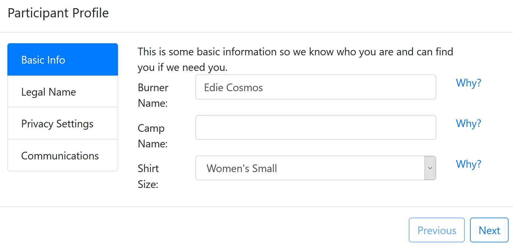
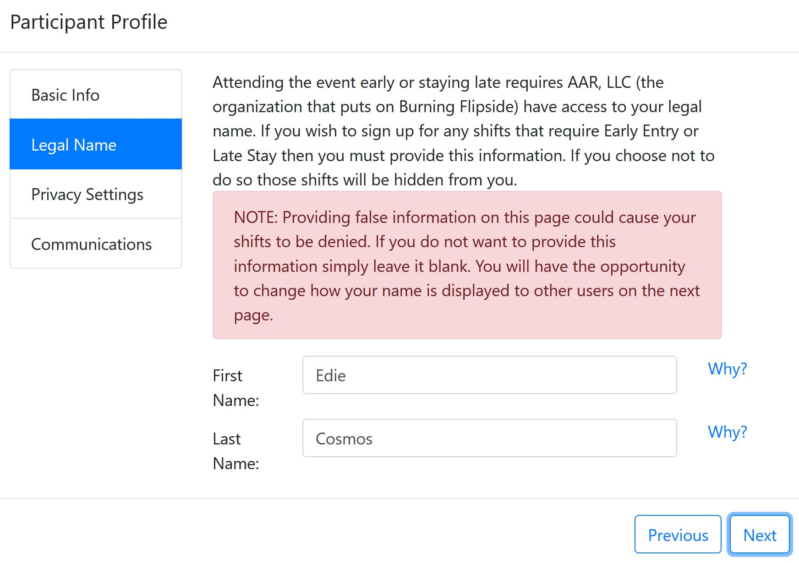
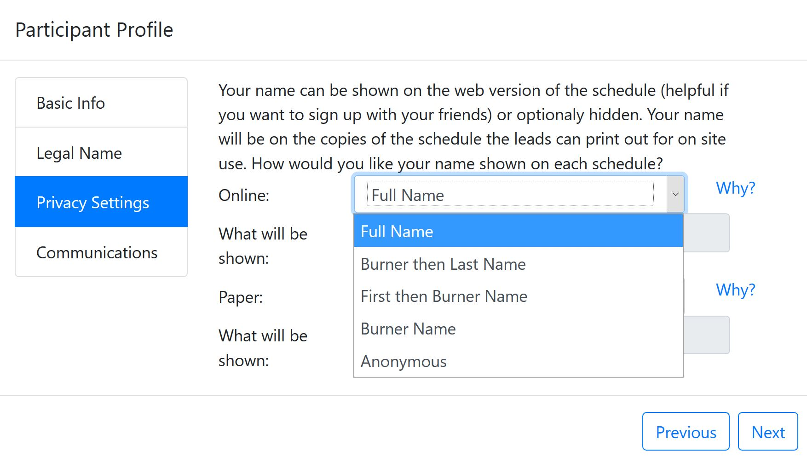
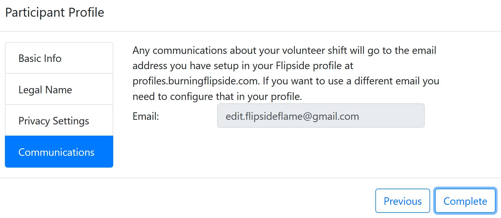
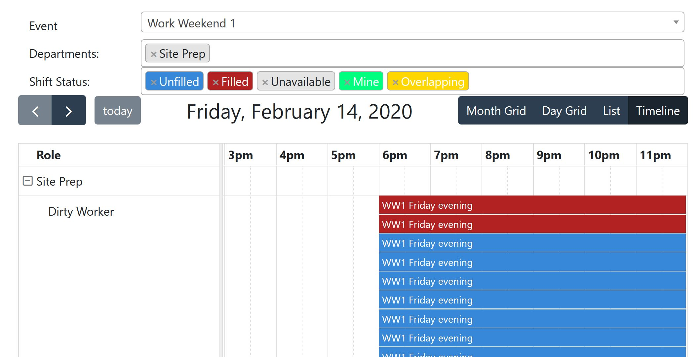
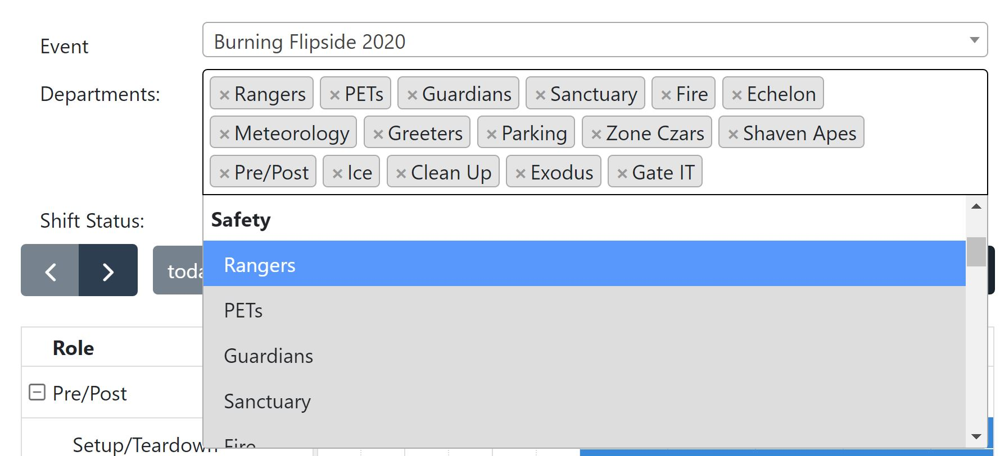
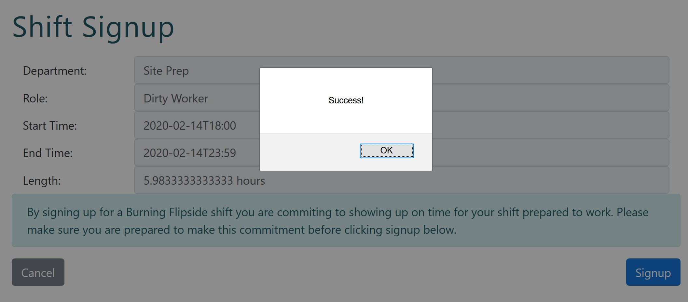
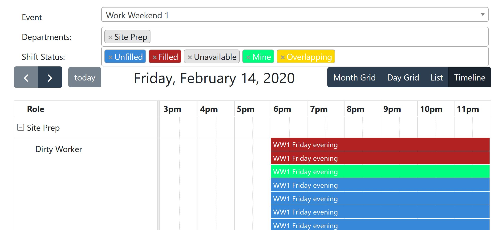

# Flipside Volunteer System User Guide

Table of Contents

1. [Caveats](#caveats-end-user)
1. [Setup Wizard](#setup-wizard)
2. [FVS Dashboard](#flipside-volunteer-system-dashboard)

## Caveats

* The FVS may work better in Chrome than Firefox or Safari. If you're having trouble with something, try changing browsers. At the very least, try using the most recent version of the browser.

* The Flipside Volunteer System (FVS) is a **single-user signup** process. Unlike the ticket request system where you can make one request for multiple people, FVS needs a separate login for each person volunteering.  

## Setup Wizard
The first time you open the Flipside Volunteer System, you'll be asked a series of questions to set up your profile. It starts with _Basic Info_.

{ width=500px }

Enter your burner name, the camp you're with (if any), and select a shirt size. 
**NOTE:** The shirt size is for future reference, and is in no way a guarantee that you are going to receive a shirt!

Click _Next_ to advance to the next screen.

The _Legal Name_ screen asks for your legal name. 

{ width=500px }

Enter your legal first and last names. Legal names are a requirement for some privileges. If you're volunteering for a role that will grant you early access or late stays, AAR, LLC has to have your legal name. If you do not wish to provide your legal name, some volunteer shifts will not show. 

Click _Next_ to advance to the next screen.

In the _Privacy Settings_ screen, you can select how your information is displayed online, and on paper. 

Use the list menus to select how you wish your name to appear. 

{ width=500px }

Click _Next_ to advance to the final screen of the wizard.

Enter your email address in the _Communications_ screen. Be sure that it is an email you have access to, and check regularly! Communications about your volunteer activities will go here, so make sure you've entered the address correctly.

{ width=500px }

Click _Complete_ to finish the wizard and see the Flipside Volunteer System in action.

## Flipside Volunteer System Dashboard
The basic dashboard has a lot of parts, so let's go through what you'll see if you volunteered for a Work Weekend with Site Prep.

{ width=500px }

### Events
Use the _Event_ list menu to select which event you're looking to volunteer for. In this example, it's Work Weekend 1.
The departments that have shifts available are listed in the _Departments_ field. Because work weekends are only under Site Prep, that's the only department listed. 

For a more complicated example, here's how it looks for Burning Flipside itself:

{ width=500px }

You can click the **x** next to the department name if you don't want to see that department's shifts, or you can add departments by selecting them from the list menu. Items that are gray in the list menu have already been selected. 

### Shift Status
Shifts are color-coded to help you easily see what is available or not. 

| Color  |   Meaning |
| ------ | --------------- |
| Blue   | Unfilled--You should sign up! |
| Red    | Filled--Someone else has signed up already |
| Green  | Your shifts--You've got this! |
| Gray   | Unavailable--Probably means you need certifications/training |
| Yellow | Overlapping--You probably want to avoid this! |

Table: Shift color coding.

Click the shift you want to pick up (remember, it'll be blue). 

You're presented with information about the shift you've selected, including the department, what role you have, and the start/end times. You'll also see just how many hours you've signed on for.

Click _Signup_ to officially sign up for the shift. When you see the _Success!_ prompt, click _OK_ to go back to the dashboard.

{ width=500px }

Your dashboard should look like this, now.

{ width=500px }

